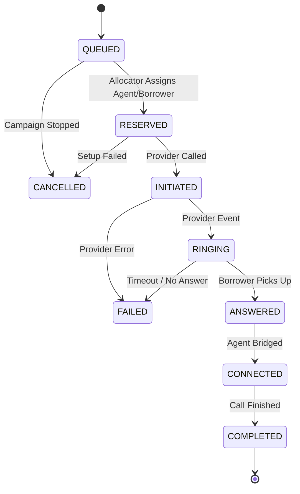

# Call State Machine

```mermaid
stateDiagram-v2
    [*] --> QUEUED
    QUEUED --> CANCELLED : Campaign Stopped
    QUEUED --> RESERVED : Allocator Assigns Agent/Borrower
    RESERVED --> INITIATED : Provider Called
    RESERVED --> CANCELLED : Setup Failed
    INITIATED --> RINGING : Provider Event
    INITIATED --> FAILED : Provider Error
    RINGING --> ANSWERED : Borrower Picks Up
    RINGING --> FAILED : Timeout / No Answer
    ANSWERED --> CONNECTED : Agent Bridged
    CONNECTED --> COMPLETED : Call Finished
    COMPLETED --> [*]
```
